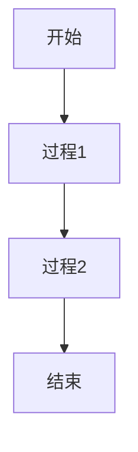

# Markdown 语法参考

## 基本语法

### 标题
```markdown
# 一级标题
## 二级标题
### 三级标题
#### 四级标题
##### 五级标题
###### 六级标题
```

### 段落
```markdown
这是一个段落。段落是由一个或多个连续的文本行组成，之间的空白行将作为段落的分隔符。

在 Markdown 中，你不需段落中的换行符来创建新段落。一个段落中的多个文本行将被视为一段。
```

### 强调
```markdown
*斜体文本*
_斜体文本_

**粗体文本**
__粗体文本__

***粗斜体文本***
___粗斜体文本___
```

### 列表
```markdown
无序列表：
- 项目 1
- 项目 2
  - 子项目 2.1
  - 子项目 2.2

有序列表：
1. 项目 1
2. 项目 2
   1. 子项目 2.1
   2. 子项目 2.2
```

### 链接
```markdown
[链接文本](https://example.com)

[链接带标题](https://example.com "链接标题")

[参考链接][id]
[id]: https://example.com "链接标题"
```

### 图片
```markdown


```

### 引用
```markdown
> 这是一个引用。
>
> 可以包含多个段落。
```

### 代码
```markdown
`行内代码`

```python
# 代码块
def hello():
    print("Hello, world!")
```
```

### 分隔线
```markdown
---
***

* * *
```

## 扩展语法

### 表格
```markdown
| 表头 1 | 表头 2 | 表头 3 |
|--------|--------|--------|
| 单元格 1 | 单元格 2 | 单元格 3 |
| 单元格 4 | 单元格 5 | 单元格 6 |
```

### 任务列表
```markdown
- [x] 已完成任务
- [ ] 未完成任务
```

### 脚注
```markdown
这是一个脚注引用[^1]。

[^1]: 这是脚注内容。
```

### 定义列表
```markdown
术语
: 定义描述
```

## 学习笔记最佳实践

### 结构化笔记
```markdown
# 主题名称
## 子主题 1
### 关键概念
- 概念1
- 概念2

## 子主题 2
### 重要公式
$$
E = mc^2
$$

### 示例代码
```python
# 示例代码
```
```

### 知识点标记
```markdown
### 📚 核心概念
- 概念描述

### 💡 重要提示
- 提示内容

### ⚠️ 注意事项
- 注意内容

### 📖 参考资源
- [链接1](url1)
- [链接2](url2)
```

### 学习进度标记
```markdown
- [ ] 待学习
- [x] 已学习
- [~] 进行中
```

## 笔记模板

### 课程笔记模板
```markdown
# 课程名称
## 授课日期
### 授课教师

## 课程概述
- 课程目标
- 主要内容

## 核心概念
### 概念1
- 定义
- 重要性
- 应用场景

### 概念2
- 定义
- 重要性
- 应用场景

## 重要公式/定理
$$
数学公式
$$

## 示例与练习
- 示例1
- 练习1

## 学习要点
- 理解核心概念
- 掌握关键技能
- 完成练习题

## 相关资源
- [教材链接](url)
- [补充资料](url)
```

### 读书笔记模板
```markdown
# 书名
## 作者
### 阅读日期

## 书籍概述
- 主题
- 主要观点

## 核心章节
### 第1章 标题
- 主要内容
- 关键观点

### 第2章 标题
- 主要内容
- 关键观点

## 重要观点
- 观点1
- 观点2

## 启发与思考
- 思考1
- 思考2

## 应用建议
- 建议1
- 建议2
```

## 高级技巧

### 使用表格组织复杂信息
```markdown
| 特性 | 描述 | 示例 |
|------|------|------|
| 特性1 | 描述1 | 示例1 |
| 特性2 | 描述2 | 示例2 |
```

### 使用代码块展示示例
```markdown
```python
# Python代码示例
def example_function():
    print("Hello, world!")
```
```

### 使用数学公式
```markdown
$$
数学公式
$$
```

### 使用mermaid图表
```markdown

```

通过遵循这些Markdown语法规范，可以创建结构清晰、易于阅读和维护的学习笔记。